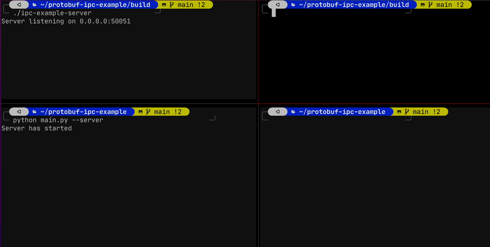

# IPC example via protobuf and gRPC
This is an example respository for IPC between `C++` and `python` via `gRPC`



# Build in docker (Strongly recommended)
```shell
git clone https://github.com/JeiKeiLim/protobuf-ipc-example.git
./run_docker.sh build
./run_docker.sh run

# (In docker)
cd protobuf-ipc-example
./run_check.sh build
```

# IPC test in docker
```shell
# Follow steps in (Build in docker)
# (In docker)

cd protobuf-ipc-example
./run_check.sh build
cd build
./ipc-example-main

# In another window
python main.py
```


# Developers
* Please refer to [CODE_OF_CONDUCT](CODE_OF_CONDUCT.md) guide.
